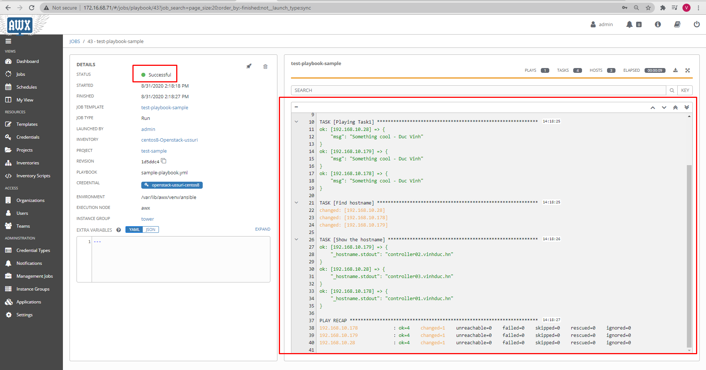

# 1.Hướng dẫn sử dụng AWX 

*AWX là một phần mềm cung cấp giao diện web cho người dùng, REST API và các công cụ thực thi dựa trên Ansible. Đây là một upstream project cho phần mềm Ansible Tower của RedHat*

- Các thành phần:
	- AWX
	- Nginx (webserver)
	- Postgres (database-server)
    - Redis (cache)
# 2.Hướng dẫn cài đặt AWX

*Hướng dẫn cài đặt AWX trên container cho centos7*

- Bước 1: Tắt firewall
```sh
systemctl stop firewalld
systemctl disable firewalld
```
- Bước 2: Disable SElinux
```sh
sed -i 's|SELINUX=enforcing|SELINUX=disabled|g' /etc/selinux/config
```
- Bước 4: Cấu hình sysctl 
```sh
echo "net.ipv4.ip_nonlocal_bind = 1" >> /etc/sysctl.conf
echo "net.ipv4.tcp_keepalive_time = 3" >> /etc/sysctl.conf
echo "net.ipv4.tcp_keepalive_intvl = 30" >> /etc/sysctl.conf
echo "net.ipv4.tcp_keepalive_probes = 8" >> /etc/sysctl.conf
echo "net.ipv6.conf.default.disable_ipv6=0" >> /etc/sysctl.conf
echo "net.ipv6.conf.all.disable_ipv6=0" >> /etc/sysctl.conf
echo "net.ipv4.ip_forward=1" >> /etc/sysctl.conf
```

- Bước 5: Khởi động lại máy
```sh
init 6
```


- Bước 6: Cài đặt epel-repository để có thể download đầy đủ các gói phần mềm
```sh
yum install -y epel-release
```

- Bước 7: Cài đặt Docker 
```sh
 sudo yum install -y yum-utils device-mapper-persistent-data lvm2
 
 sudo yum-config-manager --add-repo https://download.docker.com/linux/centos/docker-ce.repo
 
 sudo yum install docker-ce

 pip3 install docker

 pip3 install docker-compose
 
 sudo usermod -aG docker $(whoami)
 
```

- Bước 8: Khởi động Docker
```sh
 sudo systemctl enable docker.service
 
 sudo systemctl start docker.service
```


- Bước 9: Clone script cài đặt AWX từ github 
```sh
git clone https://github.com/VNPT-SmartCloud-System/awx.git
```

- Bước 10: Đứng tại thư mục cài đặt AWX
```sh
cd awx/installer
```

- Bước 11: Tạo thư mục lưu data postgres
```sh
mkdir /var/lib/pgdocker
chmod 766 /var/lib/pgdocker
```
- Bước 12: Tạo thư mục lưu projects cho awx
```sh
mkdir -p /var/lib/awx/projects
chmod 766 /var/lib/awx/projects
```

- Bước 13: Tạo cert 
```sh
openssl req -x509 -nodes -days 3650 -newkey rsa:2048 -keyout awx.key -out awx.crt
## Khai báo thông tin CSR Phần common Name là IP của node đang thực hiện
cat awx.crt awx.key > /etc/ssl/certs/awx.pem
cp awx.key /etc/ssl/certs/awx.key
cp awx.crt /etc/ssl/certs/awx.crt
chmod 600 /etc/ssl/certs/awx.pem
chmod 600 /etc/ssl/certs/awx.crt
```

- Bước 14: Khai báo trong file `inventory`:
```ini
localhost ansible_connection=local ansible_python_interpreter="/usr/bin/env python3"
[all:vars]
...
dockerhub_base=ansible
awx_task_hostname=awx
awx_web_hostname=awxweb
postgres_data_dir="/var/lib/pgdocker"
host_port=80
host_port_ssl=443
ssl_certificate="/etc/ssl/certs/awx.crt"
ssl_certificate_key="/etc/ssl/certs/awx.key"
docker_compose_dir="~/.awx/awxcompose"
project_data_dir=/var/lib/awx/projects
pg_username=awx
pg_password=awxpass
pg_database=awx
pg_port=5432
admin_user=admin
admin_password=nguyenducvinh
create_preload_data=True
secret_key=awxsecret
...
```

- Bước 15: Tiến hành cài đặt AWX bằng cách chạy playbook của ansible 
```sh
ansible-playbook -i inventory install.yml
```

*Chờ cho đến khi chạy xong playbook và không có task nào bị `failed`*

- Bước 16: Kiểm tra sau khi cài đặt

	- *Thực hiện lệnh docker ps -a để check các container đã chạy*:

	

	- *Truy cập AWX thông qua địa chỉ host của bạn*: 
	
	


- Bước 17: Điền thông tin mật khẩu đã khai báo ở bước 6


- Kết quả: 


# 3. Hướng dẫn sử dụng AWX 


*Ở đây hướng dẫn thực hiện chạy một playbook trên AWX*

## 3.1 Tạo nội dung inventory

- Bước 1: Chọn mục inventory


- Bước 2: Add thêm inventory


- Bước 3: Khai báo thông tin về tên cho inventory


- Bước 4: Tạo group trong inventory đó


- Bước 5: Khai báo thông tin cho group ( có thể tạo nhiều group )


- Bước 6: Tạo các hosts trong group chỉ định


- Bước 7: Khai báo thông tin các host (bao gồm: hostname địa chỉ ip , host_vars của host đó rồi add vào group )


## 3.2 Khai báo xác thực đến các hosts trong inventory


- Bước 1: Add thêm 1 nội dung xác thực cho các host trong  file inventory


- Bước 2: Khai báo thông tin xác thực


## 3.3 Kiểm tra kết nối của Ansible


- Bước 1: Chọn các host sẽ thực hiện ad-hoc command


- Bước 2: Thực hiện chọn module `ping` để kiểm tra kết nối của Ansible đến các hosts, chọn xác thực đã tạo


- Kết quả: `Successfull`


## 3.4 Thực hiện tạo project để chạy Playbook

- Bước 1 : Tạo mới 1 project


- Bước 2: Khai báo thông tin cho project, chọn clone 1 project từ github ( hiện tại chưa thể dùng manual vì đang cài AWX trên môi trường Docker- chưa mount thư mục )

*https://github.com/vinhducnguyen1708/ansible-tower-samples*


- Bước 3: Tạo job 


- Bước 4: Khai báo thông tin Job


- Bước 5: Thực hiện chạy playbook


- Kết quả:

