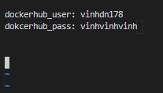

# Tìm hiểu về Ansible Vault


## 1. Ansible-Vault là gì?
- Giống như Ansible-playbook hay Ansible-galaxy, Ansible-Vault cũng là một công cụ đi kèm khi bạn cài đặt Ansible

- Ansible-Vault thực hiện mã hóa các biến và các file để bạn có thể bảo vệ các nội dung nhạy cảm như passwords hoặc key thay vì việc để dạng clear text trong playbooks hoặc roles.

- Để sử dụng Ansible Vault, một công cụ dòng lệnh có tên là ansible-vault được sử dụng để tạo, chỉnh sửa, mã hóa, giải mã và xem tệp.

- Ansible Vault có thể mã hóa mọi dữ liệu có cấu trúc tệp được sử dụng bởi Ansible. Điều này có thể bao gồm các biến inventory, các tệp biến được bao gồm trong một playbook, các tệp biến được truyền vào khi thực thi playbook hoặc các biến được định nghĩa trong Ansible.

- Mật mã được sử dụng để bảo vệ tệp là AES256 trong các phiên bản gần đây của Ansible, nhưng các tệp được mã hóa bằng các phiên bản cũ hơn vẫn có thể sử dụng 128-bit AES.


## 2. File mã hóa
### 2.1 Tạo File mã hóa
- Để tạo một file được mã hóa, sử dụng lệnh
```sh
ansible-vault create <filename>
```
- Prompts sẽ hiện lên để yêu cầu bạn khai báo vault password

    

- Sau đó hãy điền các biến và giá trị vào file này rồi lưu lại như khi sử dụng `vi`

    

- Thay vì bạn phải khai báo vault password trên prompt thì có thể khai báo trong file
```sh
echo "sicloud" >> vault_pass

ansible-vault create --vault-password-file=vault_pass <filename>
```
### 2.2 Xem File mã hóa

- Sử dụng câu lệnh để xem nội dung file đã được mã hóa:
```sh
ansible-vault view <filename>
#hoặc
ansible-vault view --vault-password-file=vault_pass <filename>
```

### 2.3 Chỉnh sửa File mã hóa đã tồn tại

- Khi đã tồn tại file mã hóa thì ta sẽ chỉ có thể edit chứ không tạo được file khác:
```sh
ansible-vault edit <filename>
#hoặc
ansible-vault edit --vault-password-file=vault_pass <filename>
```

### 2.4 Mã hóa một file đã tồn tại
- Đây sẽ là trường hợp ta sử dụng nhiều nhất bởi thường ta sẽ khai báo các biến trên file yaml trước rồi mới mang đi mã hóa
```sh
ansible-vault encrypt secret1.yml secret2.yml
```

### 2.5 Giải mã File 
- Khi muốn loại bỏ vault password và đưa file về dạng clear text:
```sh
ansible-vault decrypt <filename> --output=<filename-decrypted>
```

### 2.6 Đổi vault password của một file mã hóa
```sh
[student@demo ~]$ ansible-vault rekey secret.yml
Vault password: redhat
New Vault password: RedHat
Confirm New Vault password: RedHat
Rekey successful

#hoặc
ansible-vault rekey \
> --new-vault-password-file=NEW_VAULT_PASSWORD_FILE secret.yml
```
### 2.7 Tạo một string mã hóa
- Ví dụ ta muốn mã hóa password của tài khoản sẽ sử dụng khi chạy Ansible ( ví dụ docker hub)
```yaml
- name: Login Docker
  docker_login:
    username: vinhdn178
    password: vinhvinhvinh
 ```
Việc khai báo như thế này sẽ làm lộ mật khẩu của tài khoản
- Vậy nên ta sẽ mã hóa password `vinhvinhvinh`:
```sh
[root@deployment Ansible-Openstack]# ansible-vault encrypt_string vinhvinhvinh  
New Vault password: 
Confirm New Vault password: 
!vault |
          $ANSIBLE_VAULT;1.1;AES256
          63663766643061653163306632313934363739666338616538653339656533613635316230316135
          6230623266643730633861316564396364336665353966610a333336323764643461343263343132
          31343861613661363935653632333964633764343531616564393965303230313937666361386538
          6562383236323461640a343434353630663965356239363039643139336230336265653237333961
          63366163623065373033663234623635393539373262363832633634626562633566
Encryption successful
```
- Sau đó đưa string `vinhvinhvinh` ở task đó thành một biến và copy nội dung output ra vào giá trị của biến đó:
```yml
dockerhub_password: !vault |
          $ANSIBLE_VAULT;1.1;AES256
          63663766643061653163306632313934363739666338616538653339656533613635316230316135
          6230623266643730633861316564396364336665353966610a333336323764643461343263343132
          31343861613661363935653632333964633764343531616564393965303230313937666361386538
          6562383236323461640a343434353630663965356239363039643139336230336265653237333961
          63366163623065373033663234623635393539373262363832633634626562633566
```

## 3. Playbooks và Ansible vault
- Để chạy một playbook mà có thể truy cập đọc được file mã hóa của Ansible-Vault thì ta cần khai báo vault password khi chạy lệnh `ansible-playbook` nếu không khai báo sẽ xảy ra lỗi
    
    

- Để khai báp vault-password cho playbook ta thêm option `--vault-id` :
```sh
#Khai báo vault-password qua prompt
ansible-playbook -i inventory/multinodeha_hcm.ini test.yml --vault-id @prompt  -e@var-vault.yml

#Khai báo vault-password bằng file password đã được định nghĩa sẵn
ansible-playbook -i inventory/multinodeha_hcm.ini test.yml --vault-password-file=vault_pass  -e@var-vault.yml 
```

- Trong trường hợp có nhiều vault-password:
```sh
[student@demo ~]$ ansible-playbook \
> --vault-id one@prompt --vault-id two@prompt site.yml
Vault password (one):
Vault password (two):
...output omitted...
```

## 4. AWX và Ansible-Vault

- Khi thực hiện trên AWX ta sẽ không thể mã hóa các file hoặc các biến mà chỉ có thể khai báo vault-password
- **LƯU Ý!!!**: Hiện tại AWX cũng chưa hỗ trợ việc khai báo nội dung mã hóa vào giá trị của một biến trong file yaml ví dụ như:
```yml
dockerhub_pass: !vault |
          $ANSIBLE_VAULT;1.1;AES256
          61623363383765666638353763326132376165393736336334633934366638306666383430393334
          3937336333656132336132333366376134336638626230360a323636323938656138333137346434
          61356634373964323738373563636134653264323238393462623036333134663465613433306131
          3034326565666631360a373063623935313737356337393266393566303262613731623433663962
          38303435346637613930313863633634663836646636363732663761393738636463
```
Nên nếu muốn mã hóa 1 string thì ta sẽ phải đưa vào trong nội dung playbook và Ansible sẽ thực thi trong lúc chạy.

### 4.1  Hướng dẫn thực hiện khai báo vault-password trên AWX

- Bước 1: Tạo Vault Credentail


- Bước 2: Ở mỗi template nếu muốn sử dụng được phải khai báo thêm vault credential


